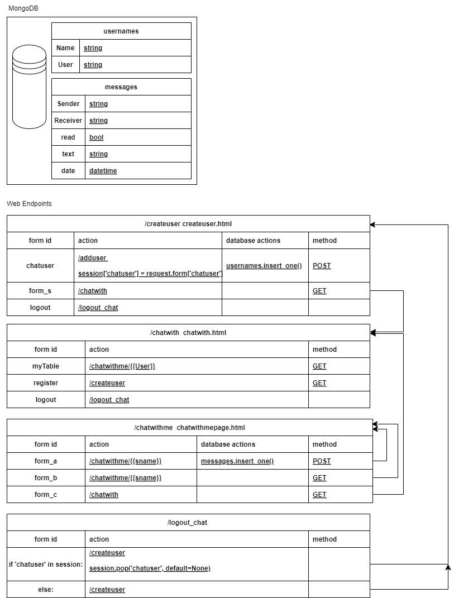

# QCIF Code Challenge

Author: Joshua Bowden
Date: 16/05/024

Original Code and Instructions from: https://earthly.dev/blog/mongodb-docker/

To run, 
- 1 Get application code
- 2 Set up a MongoDB in a docker container
- 3 Run the Flask Python application


###  1/Get the application code
git clone https://github.com/jcbowden/qcif_chat.git
cd qcif_chat
pip install -r requirements.txt


### 2/ The simplest setup of MongoDB
```
# we use a volume, so data is persisted if container is stopped
sudo docker run -d \
    -p 27017:27017 \
    --name test-mongo \
    -v data-vol:/data/db \
    mongo:latest

# or, with security
docker run -d 
    -p 27017:27017 \
    --name secure-mongo \
    -v mongo-data:/data/db \
    -e MONGODB_INITDB_ROOT_USERNAME=db-user \
    -e MONGODB_INITDB_ROOT_PASSWORD_FILE=/run/secrets/mongo-root-pw \
    mongo:latest
```


### 3/ Run the application, exposing all the network interfaces 

 (change IP address first - currently using localhost in all html template files)
```
ip -4 address
(find the machines externally acessible address)
cd templates
sed -i -e 's/localhost/<YOUR_IP_ADDRESS>/g' *
cd ..

#  N.B. using --host=0.0.0.0  so we can access the webpages
#  from outside the machine in which it is running.
python -m flask --app app_session --debug run  --host=0.0.0.0
```

## Architecture Description
The application creates a database table of ```usernames``` and a separate table of ```messages```. The messages have a ```Sender``` and a ```Receiver``` field, that correspond to a ```User``` in the ```usernames``` table. The Sender is a user that has his/her ```User``` username string added to the ```sessions['chatuser']``` cookies. The ```Receiver``` is selected from a list of users that are presented in the ```chatwith.html```page table.  
Once a ```Receiver``` is chosen by the current user (who is designated as the ```Sender```) then the ```/chatwithme/<Receiver>``` page is presented. The page presents a ```text``` area , that allows a ```message``` to be written to the database, and a formatted version is also added in a list to the ```/chatwithme/<Receiver>``` page. All previous messages between the Sender and the Receiver are presented, and sorted in chronological order using the ```message``` time stamp. A user (```Sender```) can check for messages from the ```Receiver``` and can also opt to chat with someone else (form_c), which brings them back to the ```chatwith.html```page table.  
A user can then logout as the current ```Sender```, which removes the ```session['chatuser']``` field from the session dictionary.
 

## Advanced (and untested)
### Automatic updates from DB changes 

To get changestream , we need MongoDB run as a replica set. Set up a Docker network and connect 3 images to it
```
docker network create mongoCluster
docker run -d --rm -p 27017:27017 --name mongo1 --network mongoCluster mongo:5 mongod --replSet myReplicaSet --bind_ip localhost,mongo1
docker run -d --rm -p 27018:27017 --name mongo2 --network mongoCluster mongo:5 mongod --replSet myReplicaSet --bind_ip localhost,mongo2
docker run -d --rm -p 27019:27017 --name mongo3 --network mongoCluster mongo:5 mongod --replSet myReplicaSet --bind_ip localhost,mongo3

# Access the MongoDB command line
docker exec -it mongo1 mongosh --eval "rs.initiate({
 _id: \"myReplicaSet\",
 members: [
   {_id: 0, host: \"mongo1\"},
   {_id: 1, host: \"mongo2\"},
   {_id: 2, host: \"mongo3\"}
 ]
})"


# Check that the replica set is running:
docker exec -it mongo2 mongosh --eval "rs.status()"
```